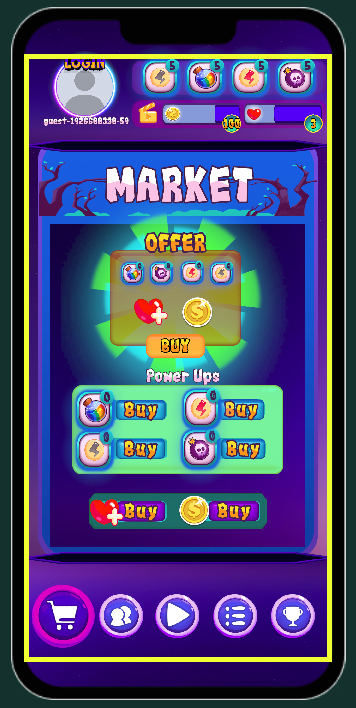
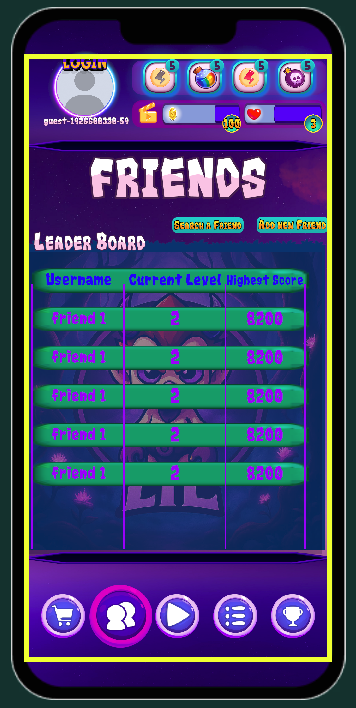
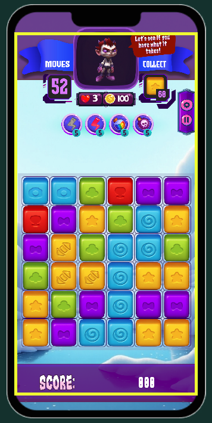
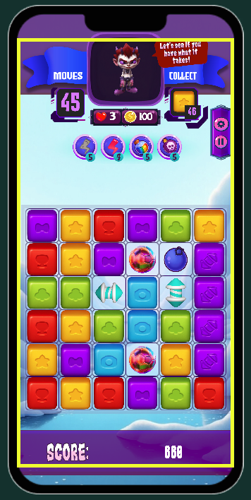
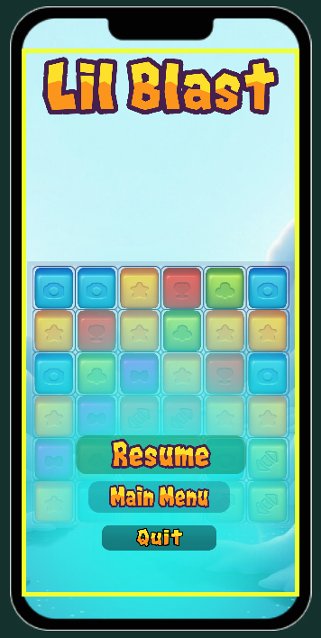
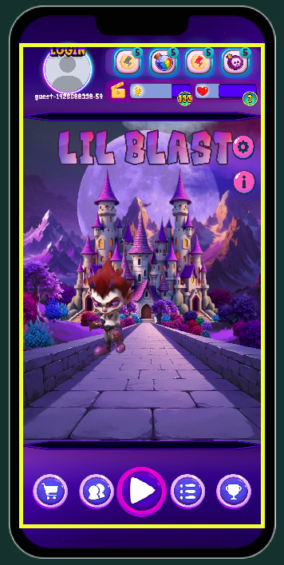
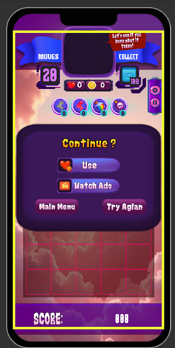

# LilBlast Puzzle

## 1. Project Overview
<p align="center">
   
  
  

  
  This repository contains the **Unity client application** for a mobile puzzle game (Match-3 genre) that integrates with a custom backend for authentication, player data, and progression management.
The client is responsible for:

* Game presentation and interaction
* Authentication flows (guest, email/password, OAuth where applicable)
* Secure communication with the backend API
* UI/UX rendering and responsiveness across mobile devices
* Managing local session state and syncing with backend services

 <p align="center">
   
  
  

Target platforms:
* **Android**
* **iOS**

The project is designed with a **mobile-first**, **performance-conscious**, and **backend-driven** architecture.

---

## 2. Game Description
<p align="center">
 
  
  
  
### Genre

* Match-3 / Puzzle

### Core Gameplay

* Tile-based match-3 mechanics
* Level-based progression
* Score, moves, and objective-driven levels
* Visual feedback via animations and effects

### Player Experience Goals
<p align="center">
  
  
  

* Smooth performance on mid-range mobile devices
* Fast startup and login experience
* Clear UI hierarchy and touch-friendly controls
* Short, repeatable play sessions

---

## 3. High-Level Architecture (Client-Side)

### Architectural Style

* Component-based Unity architecture
* Clear separation between:

  * UI Layer
  * Gameplay Logic
  * Network / Backend Integration
  * Persistence & Session Management

### Key Principles

* Minimal coupling to backend implementation details
* DTO-based request/response handling
* Environment-aware configuration (local / dev / prod)

---

## 4. Backend Integration

### Backend Responsibilities (Out of Scope for Client)

* Authentication & authorization
* User profile management
* Inventory and progression persistence
* Token issuance (JWT)

### Client Responsibilities

* Acquire and store authentication tokens
* Attach tokens to API requests
* Handle authentication lifecycle (login, logout, refresh if applicable)

### Base API Configuration

* Configurable **Base API URL**
* Supports local network testing (e.g. same Wi-Fi backend access)
* HTTPS handling (temporary HTTP allowances for test builds only)

---

## 5. Authentication Flows

### Supported Login Types

* Guest login (automatic on first launch)
* Email / password login
* OAuth (planned / optional depending on backend configuration)

### Login Flow Summary

1. App starts
2. Checks for existing auth token in local storage
3. If missing or invalid:

   * Initiates guest login
4. Stores token securely using PlayerPrefs (or platform-secure storage if extended)
5. Uses token for all subsequent backend requests

### Relevant Components

* `LoginManager`
* Auth DTOs (request / response models)

---

## 6. Networking Layer

### Technology

* `UnityWebRequest`

### Design Considerations

* Centralized request handling
* Explicit timeout and error handling
* Clear separation between:

  * Transport errors
  * Backend validation errors
  * Authentication errors

### Error Handling Strategy

* Network failures handled gracefully
* User-friendly messages surfaced to UI layer
* Detailed logs available in development builds

---

## 7. UI / UX System

### UI Framework

* Unity UI (UGUI)
* Canvas-based layout

### Design Characteristics

* Mobile-optimized layouts
* Resolution-independent scaling
* Rounded panels, buttons, and input fields
* Consistent spacing and alignment via layout groups

### UI Components

* Login screens
* Menus and panels
* Level selection UI
* In-game HUD

### External Tools

* UI assets and layouts may be designed externally (e.g., Canva) and imported

---

## 8. Performance Targets

### Frame Rate

* Target: **60 FPS** on mobile
* Fallback: **30 FPS** on low-end devices

### Optimization Focus

* Minimal overdraw in UI
* Efficient animations
* Controlled use of particle effects
* Avoidance of unnecessary allocations in gameplay loops

---

## 9. Project Structure (Conceptual)

```
Assets/
 ├── Scripts/
 │    ├── Auth/
 │    ├── Network/
 │    ├── Gameplay/
 │    ├── UI/
 │    └── Core/
 ├── Scenes/
 ├── Prefabs/
 ├── Art/
 ├── Animations/
 └── Resources/
```

This structure enforces:

* Clear domain separation
* Easier scalability as features grow

---

## 10. Configuration & Environments

### Environment Handling

* Base API URL configurable per environment
* Development builds may allow HTTP for local testing
* Production builds enforce HTTPS

### Common Configuration Points

* API base URL
* Request timeouts
* Feature flags (if enabled)

---

## 11. Build & Deployment

### Supported Build Targets

* Android (APK / AAB)
* iOS (Xcode project)

### Build Notes

* Mobile platform settings configured for performance
* Test-only flags must be removed before production builds
* Backend URLs must be verified before release

---

## 12. Logging & Debugging

### Logging

* Verbose logs enabled in development builds
* Reduced logging in release builds

### Debug Scenarios

* Authentication failures
* Network connectivity issues
* Invalid backend responses

---

## 13. Security Considerations (Client-Side)

### Implemented

* Token-based authentication
* No hardcoded credentials

### Limitations

* Client is not a trusted environment
* Sensitive validation always handled by backend

---

## 14. MVP Scope Clarification

Included in MVP:

* Core match-3 gameplay
* Guest authentication
* Backend connectivity
* Basic UI flows

Out of MVP (planned / optional):

* Social features
* Leaderboards
* Cloud saves across devices
* Advanced analytics

---

## 15. Assumptions & Constraints

* Backend is available and stable
* Client and backend API contracts are versioned
* Mobile-first design has priority over desktop support

---

## 16. Maintenance & Extension Guidelines

* New features should follow existing architectural boundaries
* Avoid introducing backend logic into client
* Prefer configuration over hardcoded values
* Re-evaluate performance after each major feature addition

---

## 17. Ownership & Responsibility

This repository contains **only the client-side implementation**. Backend logic, data integrity, and security enforcement remain strictly server-side.

---

## 18. Summary

This Unity client project serves as a scalable, maintainable, and production-oriented foundation for a mobile match-3 game integrated with a modern backend system. The architecture prioritizes clarity, performance, and long-term extensibility while keeping the MVP scope intentionally focused.


<p align="center">
  <br/>
  
  
</p>
